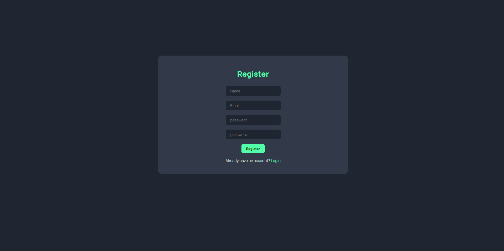
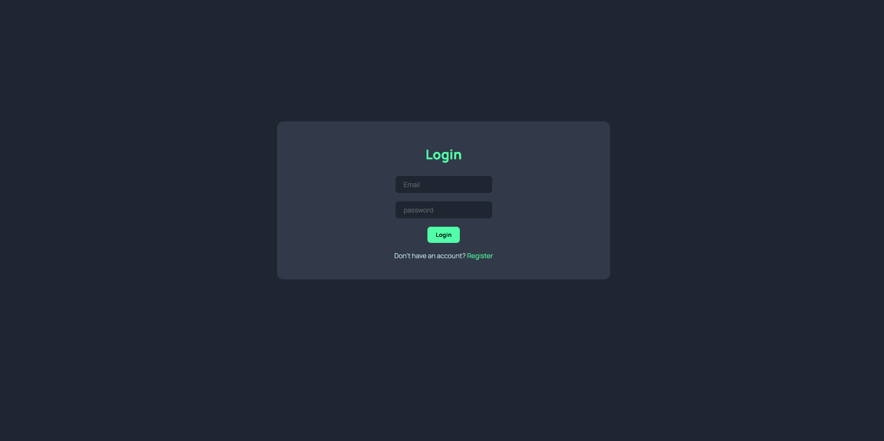
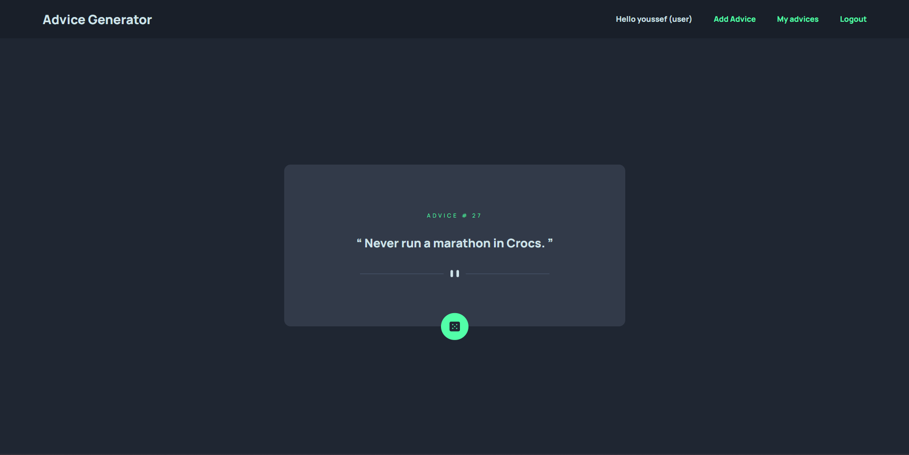
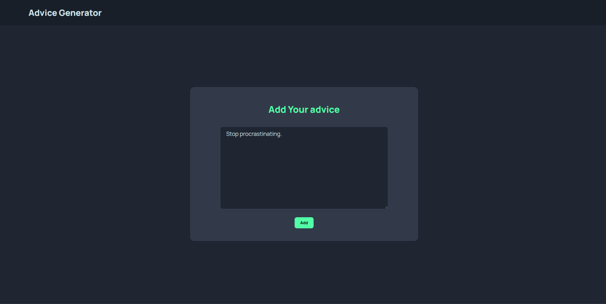
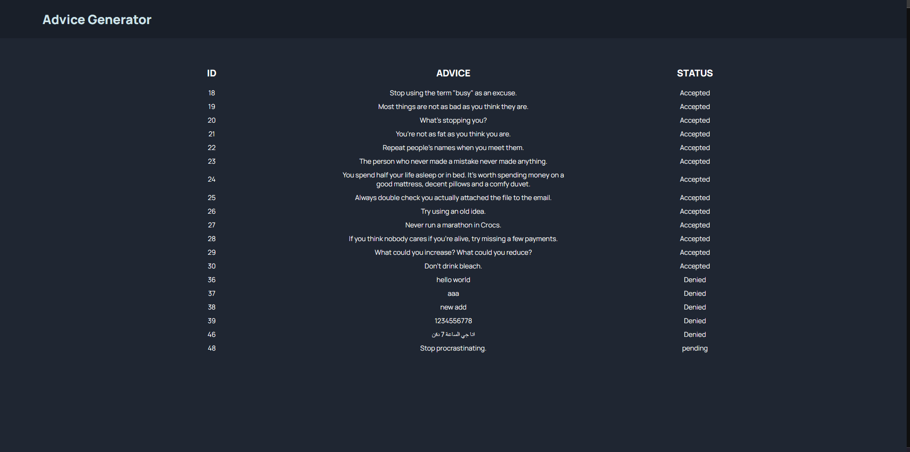
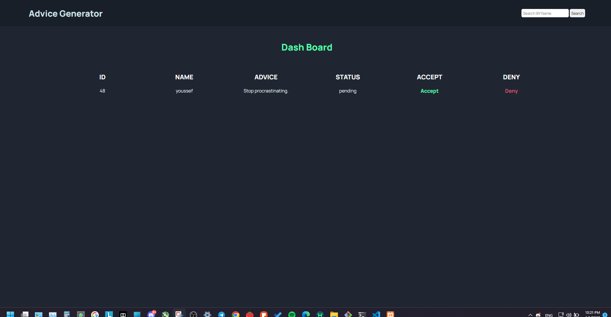

# Advice_Generator_PHP

### 
Its a simple project to share advices with others

### 
i made this project as an assignment for my college and it completed (still need some edits)

## project pages

## User prespective

### Admin prespective

## The project contain:
1- Register, login and logout

2- add advice page to make users share there advices

3- admin dashboard to control the advices

4- the project made using html,css and php only

## How to run and use the project?

1- make a database named Advice_gen and apply all the tables and data in the sql file

2- create and account or login with any account you like in the databse

3- add your advises or qouts

4- there is an admin account with admin dashboard to accept or deny the advices that other users add 

5- finaly the advices that accepted will appear randomly in the home page when you press the button

### I get the design form front-end mentor:
https://www.frontendmentor.io/challenges/advice-generator-app-QdUG-13db/hub
### The original design works using API that get random advice and has only one page (homepage) 

